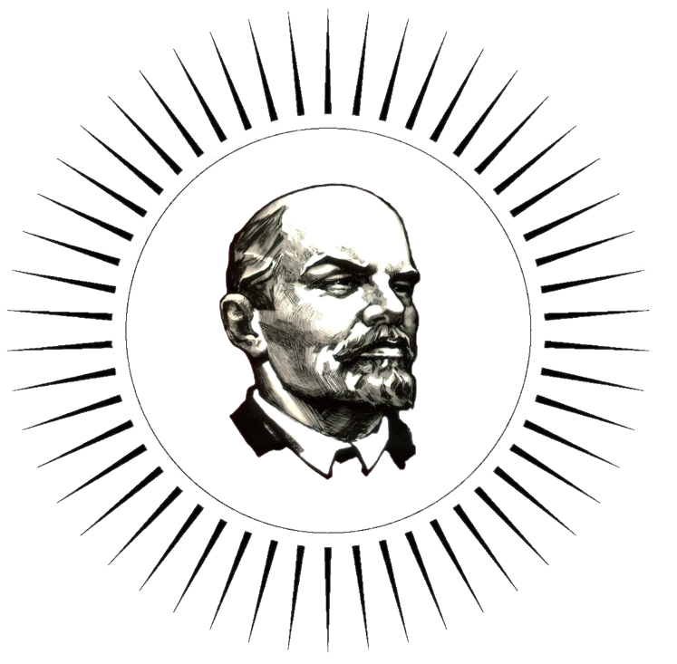

<h1>Возрожденный ленинизм</h1>

 https://vladlenin.ru/ 
Почта для обращений по вопросам сотрудничества:  reborn_leninism@list.ru 

**Возрождённый ленинизм** — это современное общественное движение, которое стремится объединить классические марксистско-ленинские идеи с передовыми технологиями и научными достижениями для решения глобальных проблем и улучшения качества жизни. Это движение подчёркивает важность:
1. **Интеграции науки и технологий** в основу социальных и экономических реформ, используя ИИ, робототехнику, биотехнологии и другие инновации для развития общества.
2. **Социальной справедливости и равенства**, переосмысливая традиционные марксистско-ленинские цели через призму современных глобальных вызовов и технологических возможностей.
3. **Глобального сотрудничества и международного партнёрства**, расширяя идеи интернационализма для включения международных научных и технологических сообществ в поиск решений мировых проблем.
4. **Этического использования технологий**, разрабатывая рамки для ответственного и прозрачного применения ИИ, генетических исследований и цифровых инноваций для обеспечения устойчивого и инклюзивного развития.
5. **Демократизации доступа к информации и технологиям**, обеспечивая равный доступ к образовательным и технологическим ресурсам для стимулирования индивидуального и коллективного роста.

Возрождённый ленинизм видит в технологическом прогрессе не только средство экономического развития, но и инструмент для реализации социалистических идеалов в новом веке, поддерживая устойчивое развитие, социальную инклюзию и активное гражданское участие в управлении обществом.

Идеалогия возрожденного  ленинизма представляет собой сплав  основы классической социалистической идеи с современными технологическими решениями. Мы стремимся использовать передовые достижения науки и техники для решения социальных и экономических проблем, что ставит Возрождённый ленинизм в особую нишу на политическом спектре. Отличаясь от коммунистов своей технологической направленностью и от социал-демократов — четкостью идеологических выходов, Возрожденный ленинизм предлагает уникальный синтез идеологии и инноваций.

<h2>“Инновации для всех, а не для избранных!”</h2>

<h2>“ИИ и биотехнологии: пути к равенству и справедливости!”</h2>

<h2>“Социальная справедливость через технологическое развитие!”</h2>

<h2>“Этично и прозрачно: технологии для людей!”</h2>

<h2>“Доступ к знаниям — право каждого!”</h2>

<h2>“Инклюзивное общество через цифровое народовластие!”</h2>

<h2>“Новые технологии — новые возможности для всех!”</h2>

<h2>“Работники научного фронта — в авангарде перемен!”</h2>

Мы, члены общественного объединения "Возрожденный ленинизм" , объединяемся в уверенности, что наука и технология являются ключом к решению глобальных проблем и улучшению жизни всех людей.  Мы стремимся создать общество, где каждый может жить в условиях, обеспечивающих его благосостояние, равенство и устойчивое развитие, в обществе, которое неизбежно повлечет наступление коммунизма. Конечной целью нашего общественного объединения является обеспечение благосостояния всех граждан. Мы уделяем особое внимание социальной справедливости, равенству и устойчивому развитию, понимая, что только при равном доступе к ресурсам и возможностям каждый человек сможет достичь своего потенциала.
Наш проект объединяет политические технологии, медицину, робототехнику, биологию, исследования ДНК и искусственный интеллект. Вместе эти области науки и техники могут привести к созданию новых технологий, которые изменят мир. 

**Что мы делаем?** 
Мы разрабатываем новые технологии, которые могут быть использованы в различных областях, таких как медицина, сельское хозяйство, экология и многих других. Мы создаём роботов, которые могут работать вместе с людьми, помогая им в выполнении различных задач. Мы исследуем ДНК, чтобы понять, как она влияет на развитие организмов и как можно использовать эти знания для создания новых технологий. Мы разрабатываем алгоритмы искусственного интеллекта, которые могут анализировать большие объёмы данных и делать выводы, которые помогут нам в наших исследованиях.
 **Почему это важно?** 
Наш проект имеет большое значение для будущего человечества. Мы создаём технологии, которые могут помочь людям жить дольше, быть здоровее и счастливее. Мы разрабатываем решения, которые могут улучшить экологическую ситуацию в мире. Мы создаём новые возможности для развития науки и техники. 
**Как вы можете помочь?** 
Если вы интересуетесь робототехникой, биологией, исследованиями ДНК или искусственным интеллектом, то наш проект может быть вам интересен. Мы ищем талантливых и увлечённых людей, которые хотят внести свой вклад в создание будущего. 

**Мы предлагаем вам возможность работать над интересными и сложными задачами, учиться у лучших специалистов в своих областях и создавать технологии, которые изменят мир.** 
**Присоединяйтесь к нашему проекту и станьте частью чего-то великого!** 

